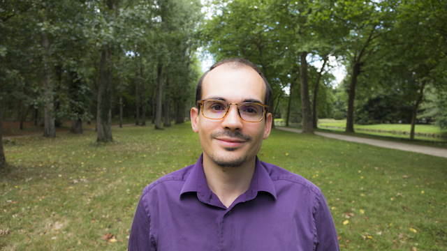

 

Bienvenue sur ce blog ! Je suis Stéphane, un développeur passionné depuis toujours. Je suis très curieux et j'aime explorer tous les aspects de mon métier, qu'ils soient fonctionnels, humains ou techniques.

Deux valeurs me tiennent particulièrement à coeur :

Le **travail d'équipe**, qui est une véritable chance pour nous autres développeurs, car l'entraide nous permet non seulement de livrer des produits plus qualitatifs, mais aussi de progresser en partageant nos connaissances et nos expériences diverses.

Je suis également très rigoureux sur la **qualité**. Celle-ci influe énormément sur la valeur des logiciels que nous concevons, et nous devons faire de notre mieux pour livrer le code le plus qualitatif possible.

Bien évidemment, tout ceci est compatible avec les valeurs de l'**agilité** et du **software craftsmanship**, avec lesquelles je me sens proche.

D'un point de vue technique, mes sujets favoris sont : les **tests** et **l'automatisation** (usine logicielle),  **DDD**, **Java** et **l'écosystème JVM** ou encore la **programmation fonctionnelle**. 

Je me décide à lancer ce blog, car il va m'aider à approfondir certains thèmes que j'étudie dans le cadre de ma veille, et à partager mon expérience sur certains sujets techniques. Ce sera aussi l'occasion d'apporter une modeste contribution envers la communauté qui m'a tant apporté !

Pour en savoir plus sur moi:

- [Mon CV](cv2018.pdf){:target="_blank"}
- [Mon Github](https://github.com/{{ site.author.github }}){:target="_blank"}
- [Mon profil Linkedin](https://linkedin.com/in/{{ site.author.linkedin }}){:target="_blank"}
- [Mon profil Malt](https://www.malt.fr/profile/stephanepetit){:target="_blank"}
- [Mon Twitter](https://twitter.com/{{ site.author.twitter }}){:target="_blank"}
